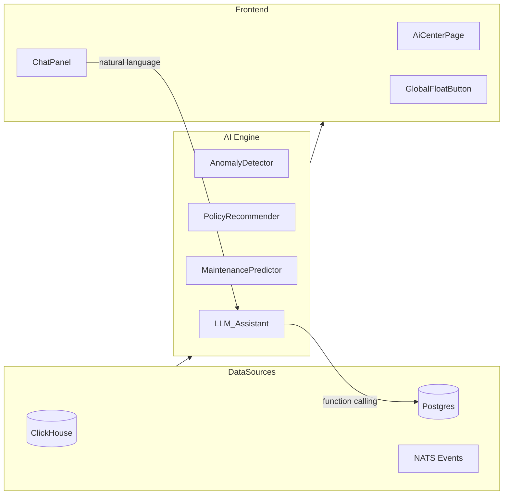

# AI 智慧管控设计

## 概述

DMSX 平台内建 AI 辅助能力，将传统"规则+阈值"运维升级为**智慧管控**：



## 四大 AI 功能模块

### 1. 异常检测（Anomaly Detection）

| 阶段 | 方法 | 数据源 |
|------|------|--------|
| Phase0 | 规则 + 统计阈值（滑动窗口、Z-score） | CH 心跳、遥测、命令回执 |
| Phase1 | 时序异常模型（Isolation Forest / AutoEncoder） | + 策略漂移事件 |
| Phase2 | LLM 辅助归因与摘要 | + 审计日志 |

**输出**：`AnomalyReport`（级别、设备、摘要、建议操作列表）。
**触发方式**：定时任务（每分钟） + 事件驱动（心跳丢失即时告警）。

### 2. 策略推荐（Policy Recommendation）

- 分析当前设备画像（平台分布、标签、分组）+ 合规发现热点 + 历史命令成功率。
- 生成推荐策略 `spec` JSON + 灰度 `rollout` 元数据 + 风险提示。
- Phase1+ 接入 LLM 做 JSON 生成 + RAG（历史成功策略库）。
- 人工确认后一键创建策略 + 发布 revision。

### 3. 自然语言助手（AI Chat / NL2Action）

**核心能力**：将运维人员的自然语言映射为平台 API 操作。

```
用户："查看北京总部所有离线设备"
→ LLM → function_call: GET /v1/tenants/{tid}/devices?site=北京总部&online_state=offline
→ 返回结构化结果 + 自然语言摘要
```

**系统提示词**内嵌：
- 平台 API 能力清单（OpenAPI 摘要）
- 设备模型与枚举（平台、状态）
- 策略语法（spec JSON schema）
- 安全约束（高危操作需二次确认）

**LLM 后端**（可插拔）：
- OpenAI 兼容 API（GPT-4o / Claude）
- 本地部署（Ollama / vLLM + Qwen / Llama）

### 4. 预测性维护（Predictive Maintenance）

- 基于心跳趋势（CPU、内存、磁盘、网络）+ 命令失败历史。
- Phase0：滑动窗口 + 线性外推。
- Phase1：轻量时序预测（ONNX Runtime 嵌入 Rust）。
- 输出：`PredictionReport`（设备、预测问题、概率、ETA、建议操作）。

## 后端架构

```
crates/dmsx-ai/
├── src/
│   ├── lib.rs              # 公共导出
│   ├── types.rs            # AI 领域类型（Request/Response）
│   ├── engine.rs           # AiEngine trait（统一抽象）
│   ├── anomaly.rs          # RuleBasedAnomalyDetector（Phase0）
│   ├── assistant.rs        # LlmAssistant（LLM 对接）
│   ├── recommendation.rs   # PolicyRecommender
│   └── prediction.rs       # MaintenancePredictor
```

**`AiEngine` trait** 统一四大能力的接口，便于切换实现（规则 → ML → LLM）。

## API 端点

| 方法 | 路径 | 说明 |
|------|------|------|
| POST | `/v1/tenants/{tid}/ai/anomalies` | 触发异常检测 |
| POST | `/v1/tenants/{tid}/ai/recommendations` | 获取策略推荐 |
| POST | `/v1/tenants/{tid}/ai/chat` | 自然语言对话 |
| POST | `/v1/tenants/{tid}/ai/predictions` | 获取预测性维护报告 |

## 安全约束

- AI 生成的操作（命令、策略）**不自动执行**，需人工确认或审批工作流。
- LLM 调用时**不传递敏感数据**（密钥、证书内容）；仅传元数据与统计摘要。
- 审计：所有 AI 交互记录写入 `audit_logs`（`action = ai_*`）。
- 本地模型优先（数据不出域）；外部 API 需配置允许列表。

## 演进路线

| 阶段 | AI 能力 |
|------|---------|
| Phase0 | 规则异常检测 + 统计外推预测 + 基于模板的策略推荐 |
| Phase1 | 接入 LLM（对话 + 策略 JSON 生成）+ RAG + 时序 ML |
| Phase2 | 自动修复工作流（AI 提议 → 审批 → 执行 → 验证闭环） |
| Phase3 | 多模态（日志/截图分析）、知识图谱、根因分析链 |
