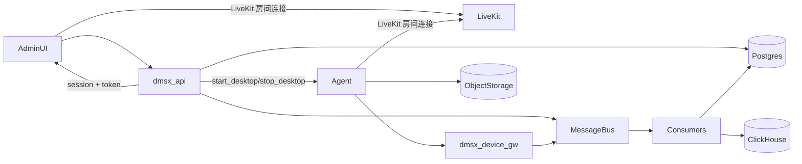

# 架构与服务边界

## 控制面 vs 数据面

| 平面 | 职责 | 本仓库对应 |
|------|------|------------|
| **控制面** | 管理台/集成 API、租户与 RBAC、策略编排、审计查询、制品元数据、远程桌面会话 | `dmsx-api`（Axum）→ 未来可拆分为独立微服务 |
| **数据面** | 设备长连接、推送命令与策略、高吞吐回执与遥测入口 | `dmsx-device-gw`（Tonic gRPC）→ 当前为演进骨架，后续经消息总线投递到消费者 |
| **设备代理** | 采集遥测、接收命令、执行远控操作、屏幕采集与键鼠注入 | `dmsx-agent`（Rust 跨平台，Windows / Linux / Android）|

**原则**：控制面以 **Postgres** 为权威状态；数据面以 **连接 + 消息流** 为主路径，回执与明细写入 **ClickHouse**（异步），关键状态回写 PG。

## 服务拆分（演进式单体 → 微服务）

当前脚手架为 **workspace 多 crate**，便于后续拆仓：

1. **api-gateway**（`dmsx-api`）：REST、限流、租户解析、审计注入、桌面会话管理、LiveKit token 签发。
2. **device-gateway**（`dmsx-device-gw`）：mTLS 终端、gRPC streaming、背压；当前仍是未来数据面主链路的骨架。
3. **device-agent**（`dmsx-agent`）：跨平台独立二进制，当前通过 HTTP 与控制面通信，并在远程桌面场景下直接加入 LiveKit 房间。
4. **device-service** / **policy-service** / **command-service** / **app-repo-service** / **compliance-service** / **network-service**：逻辑可先共库，按 bounded context 分模块，流量上来再独立进程 + gRPC 内部调用。

## 技术栈

| 层 | 选型 | 用途 |
|----|------|------|
| 语言运行时 | Rust + Tokio | 异步 IO、内存安全 |
| 控制面 HTTP | Axum | REST、中间件、OpenAPI（后续 `utoipa`）；远程桌面媒体面由 LiveKit 承担 |
| 数据面 RPC | Tonic + Prost | Agent 双向/流式通信 |
| 远程桌面 | LiveKit WebRTC + Data Channel | 屏幕共享 + 键鼠控制 |
| 屏幕采集 | `scrap`（Windows DXGI / Linux X11） | Agent 侧屏幕采集 |
| 键鼠注入 | `enigo` | Agent 侧输入模拟 |
| 关系库 | PostgreSQL + sqlx | 租户、设备、策略版本、命令状态、设备影子 |
| 缓存/会话 | Redis | 在线快照、分布式锁、速率限制 |
| 消息 | NATS JetStream（推荐）或 Kafka | 命令投递、事件、重放 |
| 分析/审计明细 | ClickHouse | 心跳、回执、遥测、不可变审计副本 |
| 制品存储 | S3 兼容 + CDN | 包体、证据、日志归档 |
| 远程桌面信令 | LiveKit Server（WebRTC，已集成 Docker Compose）| 浏览器/Agent 进房、视频轨与输入事件通道 |
| 第三方远程桌面 | RustDesk（自建 hbbs/hbbr，可选）| 备选方案 |
| 观测 | OpenTelemetry → OTLP | 指标/日志/追踪统一出口 |

## 数据流（含远程桌面）



## 远程桌面架构

```
管理员浏览器
  │  POST /desktop/session → 获取 session_id / room / token / livekit_url
  │  连接 LiveKit 房间并订阅远端视频轨
  │  通过 Data Channel 发送键鼠事件
  ▼
LiveKit
  ▲
  │  dmsx-agent 收到 start_desktop 后加入房间并发布屏幕轨
  │  scrap::Capturer 采集屏幕，enigo 注入输入
  ▼
被管设备屏幕 / 键鼠
```

**当前状态**：远程桌面主链路已切换为 LiveKit WebRTC；`dmsx-device-gw` 仍保留为后续设备长连接数据面的演进方向，而不是当前 Agent 的主通信路径。

## 与外部系统集成

- **身份**：OIDC / SAML（企业 SSO）；设备侧 **mTLS + enrollment token**。
- **EDR/SIEM**：Webhook 或 Kafka 出站；合规服务消费告警关联 `device_id`。
- **网络**：本阶段以 **策略下发 + 对接现有 ZTNA/SD-WAN API** 为主，不自研完整数据面。
- **远程桌面**：LiveKit WebRTC（主）+ RustDesk（备选）。
