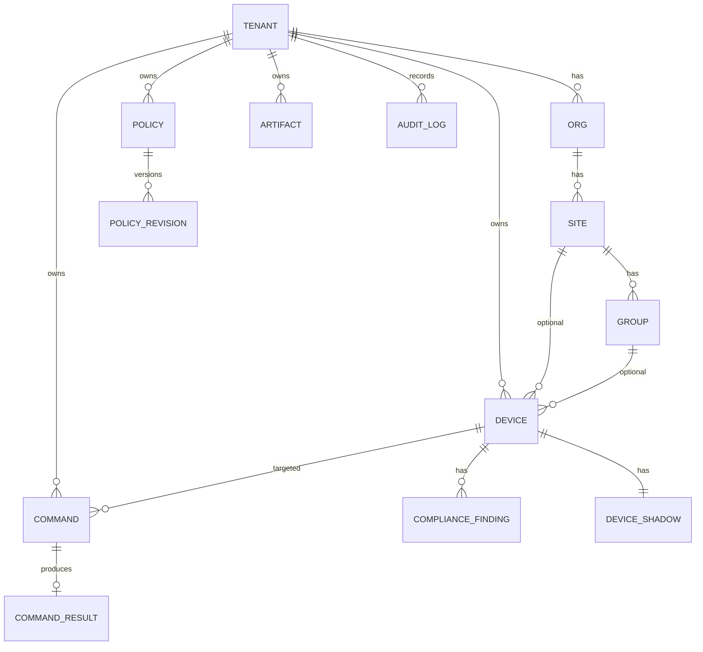

# 领域模型与存储

## 资源层级

```
Tenant
  └── Org
        └── Site
              └── Group
                    └── Device（也可挂 Site，primary_group 可选）
```

- 所有业务表含 **`tenant_id`**，查询默认带租户谓词；进阶可使用 **PostgreSQL RLS**（`SET app.tenant_id = ...` + policy）。
- **标签** `devices.labels`（JSONB）用于 ABAC / 策略选择；`scope_kind = label` 时 `policies.scope_expr` 存表达式。

## 核心实体（与 `dmsx-core` / `migrations/001_init.sql` 对齐）

| 实体 | 说明 | 关键字段 |
|------|------|----------|
| **Tenant** | 租户边界 | `id`, `name` |
| **Org / Site / Group** | 管理结构与策略作用域 | 外键链 + `tenant_id` |
| **Device** | 被管端 | `platform`, `enroll_status`, `online_state`, `last_seen_at`, `labels`, `capabilities` |
| **Policy** | 策略逻辑行 | `scope_kind`, `scope_*`, `scope_expr` |
| **PolicyRevision** | 不可变发布版本 | `version`, `spec`（声明式 JSON）, `rollout`（灰度元数据） |
| **Command** | 远程命令 | `idempotency_key`, `target_device_id`, `payload`, `ttl_seconds`, `status` |
| **Artifact** | 应用/脚本制品元数据 | `sha256`, `signature_b64`, `object_key`, `channel` |
| **AuditLog** | 管理面审计 | `action`, `resource_type`, `resource_id`, `payload` |
| **ComplianceFinding** | 合规/基线发现 | `rule_id`, `severity`, `status`, `evidence_object_key` |
| **DeviceShadow** | 设备影子（双态） | `reported`（Agent 上报 JSONB）, `desired`（管理员期望 JSONB）, `version`（乐观并发）|
| **CommandResult** | 命令执行结果 | `exit_code`, `stdout`, `stderr`, `evidence_key`, `reported_at` |

## 与 ClickHouse 的划分

| 数据 | Postgres | ClickHouse |
|------|----------|------------|
| 设备权威记录、策略当前版本指针 | 是 | 可选维度表同步 |
| 命令最终状态 | 是 | 明细事件流 |
| 心跳、回执全文、高频遥测 | 摘要或可空 | 主存储 |
| 审计流水 | 权威（合规） | 分析副本 + 冷归档 |

## ER 示意


